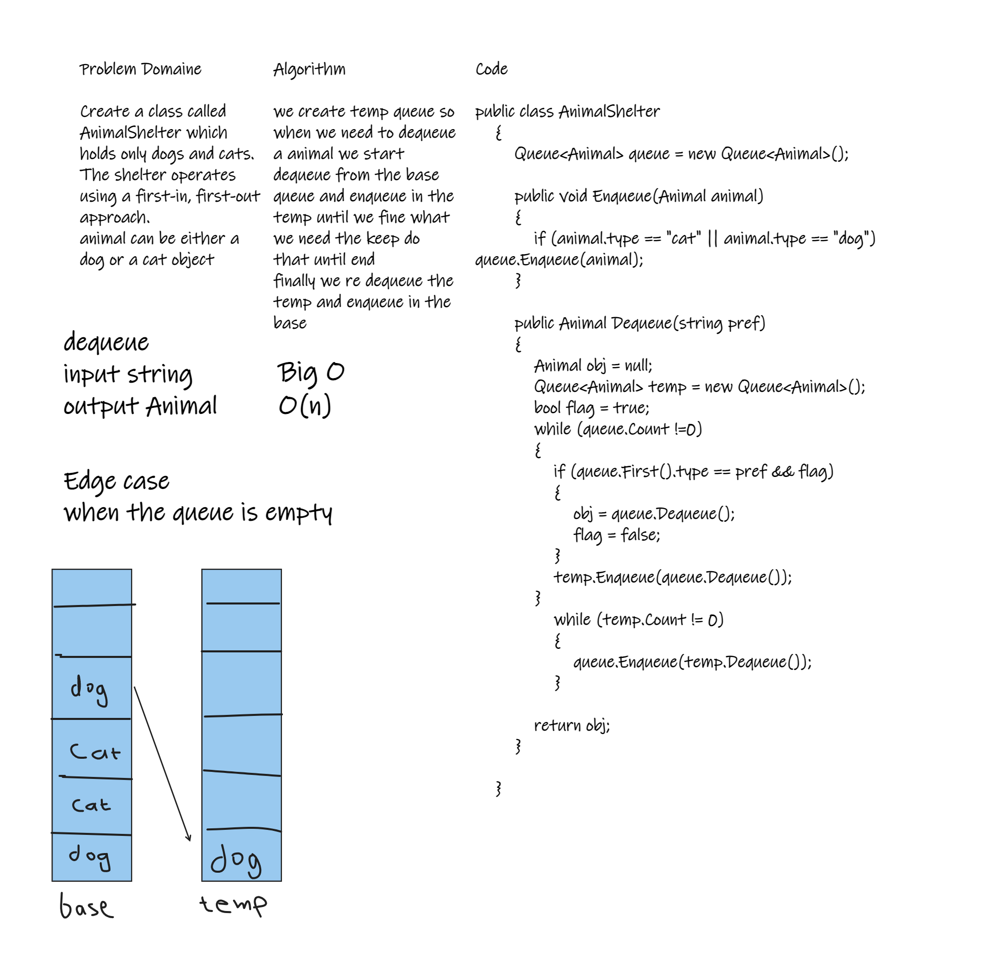

# Challenge Summary
Create a class called AnimalShelter which holds only dogs and cats.
The shelter operates using a first-in, first-out approach.

## Whiteboard Process

## Approach & Efficiency
Enqueue method has O(1) time and space complexite

## Solution
1. Open the sln File 
2. run the program.cs file 
3.

    public class AnimalShelter
    {
        Queue<object> queue = new Queue<object>();

        public void Enqueue(Cat animal)
        {
            queue.Enqueue(animal);
        }
        public void Enqueue(Dog animal)
        {
            queue.Enqueue(animal);
        }
        public object Dequeue(string pref)
        {
            object obj = null;
            Queue<object> temp = new Queue<object>();
            bool flag = true;
            if (pref != "cat" || pref !="dog") return null;

            if (queue.First().Equals(pref)) return queue.Dequeue();
            else 
            {
                while (queue.Count!=0)
                {
                    temp.Enqueue(queue.Dequeue());
                    if (queue.First().Equals(pref) && flag)
                    {
                        obj = queue.Dequeue();
                        flag = false;
                    }
                }
                while (temp.Count != 0)
                {
                    queue.Enqueue(temp.Dequeue());
                }
            }
            return obj;
        }

    }
